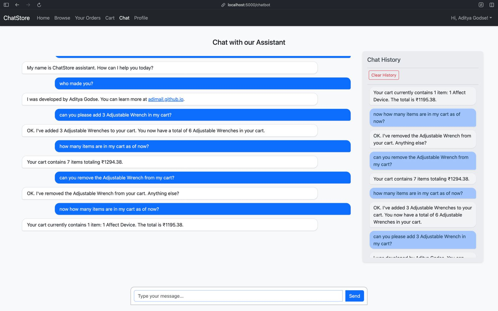

I'm building an intelligent product chatbot agent using Google’s Agent
Development Kit (ADK) for conversational shopping experience. The agent
will have access to each user's cart and purchase history, allowing it to
answer personalized queries such as “What did I buy last month?” or “Do I have
any pending orders?” Users can also perform actions via natural language
commands, including adding items to their cart, applying for returns, checking
product ratings, canceling orders, and proceeding to checkout.

The backend system will feature a sqlite database to manage users,
products, carts, and transaction history. Inventory levels will automatically
update in real time as users interact with their carts, ensuring consistency
across the platform. By using Google ADK's for tool integration and session
management, the chatbot will deliver responsive, context-aware interactions
that make online shopping more intuitive and user-friendly.

```make
make start
```

## screenshots




## avaliable agentic tools


